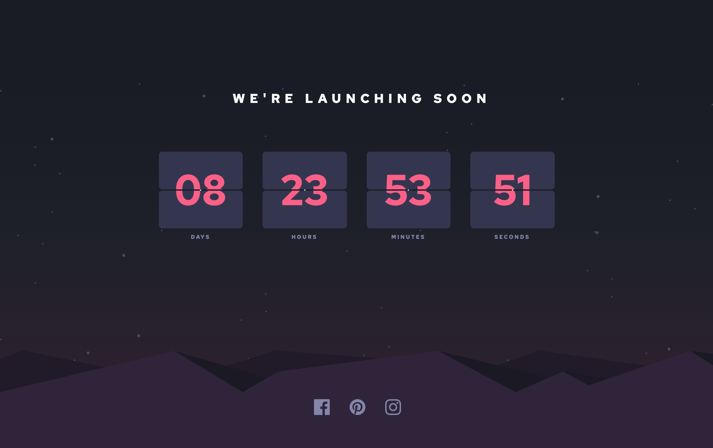

# Frontend Mentor - Launch countdown timer solution

This is a solution to the [Launch countdown timer challenge on Frontend Mentor](https://www.frontendmentor.io/challenges/launch-countdown-timer-N0XkGfyz-). Frontend Mentor challenges help you improve your coding skills by building realistic projects. 

## Table of contents

- [Overview](#overview)
  - [Screenshot](#screenshot)
  - [Links](#links)
- [My process](#my-process)
  - [Built with](#built-with)
  - [What I learned](#what-i-learned)
  - [Continued development](#continued-development)
  - [Useful resources](#useful-resources)
- [Author](#author)
- [Acknowledgments](#acknowledgments)

**Note: Delete this note and update the table of contents based on what sections you keep.**

## Overview
Fun stuff to learn -- I spent the bulk of my time messing around with:
 - layering background images
 - clamping 
 - making the countdown clock work with zero padded single digits

That was hard enough, so I passed on trying to make the cards flip -- too fancy for me.

Users should be able to:

- See hover states for all interactive elements on the page
- See a live countdown timer that ticks down every second (start the count at 14 days)

### Screenshot




### Links

- Solution URL: [fm-launch-countdown-timer](https://github.com/techmeg/fm-launch-countdown-timer)
- Live Site URL: [fm-launch-countdown-timer](https://techmeg.github.io/fm-launch-countdown-timer/)

## My process
I stumbled a bit trying to work out the image placement and was about to try layering when I decided to look for examples of the challenge completed. Tip of the hat to @tediko -- an inspection of his site confirmed that layering was the right approach.

I also picked at his (her?) code to mess with clamping the font size. While my solution is not identical (or perfect!), the strategy was directly borrowed. Not sure I fully understand using vw units, but messed about until things looked close to right. I did not have figma/sketch so JPEGs were used to approximate styling.

Got the countdown clock working pretty well without the leading zeros but then followed many wrong paths trying to apply the leading zeros. Eventually I googled more specifically (something like pad numbers with zeros in js) and found the padStart() function which blew up a days worth of red herrings in 2 minutes.

Nothing else too special here, just some flexbox and positioning.

### Built with

- Semantic HTML5 markup
- CSS custom properties
- Flexbox
- Mobile-first workflow
- JavaScript

### What I learned
The tricksy vw, vh units and clamping:

```css
#seconds, .seconds, #minutes, .minutes, #hours, .hours, #days, .days {
    background-color: var(--Dark-desaturated-blue);
    border-radius: 5px;
    color: var(--Soft-red);
    content: "";
    display: flex;
    font-size: clamp(1.6rem, 9vw, 3.73rem);
    height: 8vw;
    max-height: 57px;
    justify-content: center;
    overflow: hidden;
    width: 17vw;
}
```
The elegant padStart() function:

```js
    days.innerText = daysRemaining.toString().padStart(2, '0');

}
```

### Useful resources

- [padStart()](https://developer.mozilla.org/en-US/docs/Web/JavaScript/Reference/Global_Objects/String/padStart)

## Author

- Frontend Mentor - [@techmeg](https://www.frontendmentor.io/profile/techmeg)


## Acknowledgments

As mentioned above, thanks to @tediko for his inspriational solution.